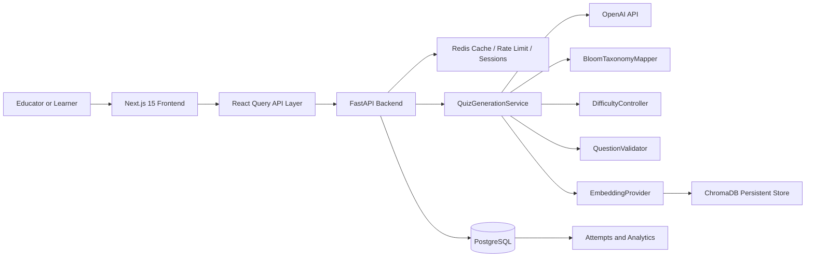

# Adaptive Quiz AI Platform

[](#backend-api)
[](#frontend-app)
[](#data-model)
[](#duplicate-detection)
[](#quality-and-testing)

A full-stack AI assessment platform that generates validated, difficulty-aware multiple-choice quizzes for any topic. The backend uses FastAPI, OpenAI-compatible generation, Bloom's Taxonomy mapping, embedding similarity checks, PostgreSQL persistence, Redis operational controls, and analytics. The frontend uses Next.js 15, TypeScript, TailwindCSS, shadcn-style UI primitives, React Query, toast notifications, and Recharts dashboards.

---

## Table of Contents

- [Product Overview](#product-overview)
- [Key Features](#key-features)
- [Architecture](#architecture)
- [Technology Stack](#technology-stack)
- [Project Structure](#project-structure)
- [Backend API](#backend-api)
- [Frontend App](#frontend-app)
- [Data Model](#data-model)
- [Duplicate Detection](#duplicate-detection)
- [Validation Strategy](#validation-strategy)
- [Local Development](#local-development)
- [Environment Variables](#environment-variables)
- [Quality and Testing](#quality-and-testing)
- [Deployment](#deployment)
- [Demo Script](#demo-script)
- [Roadmap](#roadmap)
- [Resume Impact](#resume-impact)

---

## Product Overview

Manual quiz creation is slow, inconsistent, and hard to align with measurable learning objectives. Adaptive Quiz AI automates assessment creation by generating multiple-choice questions that are:

- aligned to a requested topic and difficulty;
- mapped to Bloom's Taxonomy levels;
- checked for duplicate or overly similar wording;
- validated for answer integrity and question quality;
- persisted with analytics for review and continuous improvement.

Primary users include educators, EdTech platforms, instructional designers, corporate L&D teams, and learners who want targeted practice assessments.

---

## Key Features

### AI quiz generation
- Generates up to 10 MCQs per request.
- Supports `easy`, `medium`, and `hard` difficulty controls.
- Produces structured question, options, answer, Bloom level, difficulty score, and validation score.

### Bloom's Taxonomy intelligence
- Covers `Remember`, `Understand`, `Apply`, `Analyze`, `Evaluate`, and `Create`.
- Selects Bloom levels based on requested difficulty.
- Stores Bloom metadata for downstream analytics.

### Duplicate detection
- Generates embeddings for accepted question text.
- Uses cosine similarity to reject duplicates above the configured `0.85` threshold.
- Regenerates when a candidate question is too similar to an accepted one.

### Validation and quality scoring
- Checks topic relevance.
- Ensures answer/options integrity.
- Validates difficulty alignment.
- Flags short or low-quality questions.

### Full-stack product UI
- Landing page with product overview and CTA.
- Quiz generator form.
- Quiz-taking interface with timer and navigation.
- Results page with score and Bloom analysis.
- Analytics dashboard with charts and quiz history.

---

## Architecture



### Design principles

- **Separation of concerns:** API routes, schemas, services, validators, embeddings, and models are isolated by responsibility.
- **Async-first backend:** FastAPI and SQLAlchemy Async support concurrent LLM and database workloads.
- **Typed contracts:** Pydantic v2 and TypeScript keep request/response contracts explicit.
- **Operational portability:** Docker, Railway, Vercel, Neon, and Upstash configuration are included.
- **Quality gates:** CI runs formatting, linting, tests, and coverage checks.

See [`SYSTEM_DESIGN.md`](SYSTEM_DESIGN.md) and [`architecture.md`](architecture.md) for deeper design notes.

---

## Technology Stack

| Layer | Technology | Why it was selected |
| --- | --- | --- |
| Backend API | FastAPI | Async Python, strong OpenAPI support, lightweight service layer. |
| AI generation | OpenAI API | High-quality structured MCQ generation and embedding support. |
| Database | PostgreSQL | Reliable relational storage for quizzes, questions, attempts, and analytics. |
| ORM | SQLAlchemy Async | Mature async data access and migration compatibility. |
| Validation | Pydantic v2 | Fast runtime validation and schema generation. |
| Cache / rate limit | Redis | Low-latency counters, cache entries, and session payloads. |
| Vector search | ChromaDB | Persistent vector similarity layer for duplicate detection. |
| Frontend | Next.js 15 | App Router, deployment fit for Vercel, strong React ecosystem. |
| UI | TailwindCSS + shadcn-style primitives | Fast, consistent, responsive product UI. |
| Server state | React Query | Loading states, retries, caching, and mutation lifecycle handling. |
| Charts | Recharts | Responsive bar, pie, and trend charts for analytics. |
| Testing | pytest | Concise unit and integration testing with coverage gates. |
| Deployment | Docker, Railway, Vercel | Reproducible backend container and managed frontend deployment. |

---

## Project Structure

```text
.
├── app/                         # FastAPI backend application
│   ├── api/                     # HTTP routes and OpenAPI endpoint definitions
│   ├── core/                    # Settings and logging
│   ├── db/                      # Async database session and Alembic migrations
│   ├── embeddings/              # Embedding provider and duplicate detector
│   ├── models/                  # SQLAlchemy models
│   ├── prompts/                 # Prompt templates
│   ├── quiz_engine/             # Generation, Bloom mapping, and difficulty control
│   ├── schemas/                 # Pydantic request/response schemas
│   ├── services/                # Application orchestration and Redis helpers
│   └── validators/              # Question quality validation
├── frontend/                    # Next.js 15 frontend
│   ├── app/                     # App Router pages and layout
│   ├── components/              # Reusable UI components
│   ├── hooks/                   # React Query hooks
│   ├── public/                  # Static assets
│   ├── services/                # API client
│   └── types/                   # TypeScript API contracts
├── tests/                       # Unit and integration tests
├── docs/                        # Deployment and system design guides
├── .github/workflows/           # GitHub Actions CI
├── Dockerfile                   # Backend production image
├── docker-compose.yml           # Local backend dependencies
├── railway.toml                 # Railway backend deployment
└── vercel.json                  # Vercel frontend deployment
```

---

## Backend API

Swagger documentation is available at:

```text
http://localhost:8000/docs
```

### Endpoints

| Method | Path | Description |
| --- | --- | --- |
| `POST` | `/generate-quiz` | Generate and persist a validated quiz. |
| `POST` | `/validate-quiz` | Validate externally supplied quiz content. |
| `GET` | `/quiz/{quiz_id}` | Retrieve a persisted quiz. |
| `DELETE` | `/quiz/{quiz_id}` | Delete a quiz and related records. |
| `GET` | `/analytics` | Return generation analytics summary. |
| `GET` | `/health` | Health check for deploy platforms. |

### Generate quiz example

```bash
curl -X POST http://localhost:8000/generate-quiz \
  -H 'Content-Type: application/json' \
  -d '{
    "topic": "PostgreSQL indexing",
    "difficulty": "medium",
    "number_of_questions": 10
  }'
```

Example response shape:

```json
{
  "id": "6e7a4f2a-4b4b-4a6d-8b9a-48f7f23e7a11",
  "topic": "PostgreSQL indexing",
  "difficulty": "medium",
  "questions": [
    {
      "question": "Which option best explains PostgreSQL indexing at a medium level?",
      "options": ["...", "...", "...", "..."],
      "answer": "...",
      "bloom_level": "Analyze",
      "difficulty_score": 0.67,
      "validation_score": 0.9
    }
  ]
}
```

---

## Frontend App

The frontend lives in [`frontend/`](frontend/) and includes:

- `/` — landing page with overview, feature cards, demo panel, and CTA.
- `/quiz-generator` — form for topic, difficulty, and question count.
- `/quiz` — timed quiz-taking interface with progress and navigation.
- `/results` — score, answer review, and Bloom analysis chart.
- `/analytics` — quiz history, performance trend, difficulty bar chart, and Bloom distribution.

### Frontend commands

```bash
cd frontend
npm install
npm run dev
npm run build
```

Set the backend URL for the frontend:

```bash
NEXT_PUBLIC_API_BASE_URL=http://localhost:8000
```

---

## Data Model

| Table | Purpose |
| --- | --- |
| `users` | Optional user identity and quiz ownership. |
| `quizzes` | Quiz topic, difficulty, status, and creation metadata. |
| `questions` | MCQ text, options, answer, Bloom level, difficulty score, and validation score. |
| `attempts` | Learner answers and scores. |
| `analytics` | Generation latency, duplicate regeneration count, and validation aggregates. |

Relationships:

- A user can own many quizzes.
- A quiz has many questions.
- A quiz has many attempts.
- A quiz has one analytics record.

---

## Duplicate Detection

The duplicate detection flow is:

1. Generate a candidate question.
2. Embed the question text.
3. Compare the vector with previously accepted questions using cosine similarity.
4. Reject the candidate if similarity is greater than or equal to `SIMILARITY_THRESHOLD`.
5. Regenerate until the requested number of unique questions is accepted.

Default threshold:

```text
SIMILARITY_THRESHOLD=0.85
```

---

## Validation Strategy

The validation layer scores each question using deterministic checks before persistence:

- requested topic appears in the question text;
- four options are present;
- options are unique;
- answer exactly matches one option;
- difficulty score is aligned with the requested band;
- question has enough detail to be assessable.

This validation-first approach keeps the API predictable, testable, and safer for production integrations.

---

## Local Development

### Backend with Docker Compose

```bash
cp .env.example .env
docker compose up --build
```

Backend services:

- API: `http://localhost:8000`
- Swagger: `http://localhost:8000/docs`
- PostgreSQL: `localhost:5432`
- Redis: `localhost:6379`

### Backend without Docker

```bash
python -m venv .venv
source .venv/bin/activate
pip install -r requirements.txt
uvicorn app.main:app --reload
```

### Frontend

```bash
cd frontend
npm install
npm run dev
```

Frontend app:

```text
http://localhost:3000
```

---

## Environment Variables

| Variable | Required | Default | Description |
| --- | --- | --- | --- |
| `APP_NAME` | No | `Adaptive Quiz Generation API` | FastAPI application name. |
| `ENVIRONMENT` | No | `local` | Runtime environment label. |
| `DATABASE_URL` | Yes | SQLite fallback in code | Async SQLAlchemy database URL. |
| `REDIS_URL` | Yes | `redis://localhost:6379/0` | Redis connection string. |
| `OPENAI_API_KEY` | Production | empty | Enables live OpenAI generation and embeddings. |
| `OPENAI_MODEL` | No | `gpt-4o-mini` | Chat model used for generation. |
| `EMBEDDING_MODEL` | No | `text-embedding-3-small` | Embedding model used for similarity checks. |
| `CHROMA_PATH` | No | `.chroma` | Persistent vector storage path. |
| `SIMILARITY_THRESHOLD` | No | `0.85` | Duplicate detection cutoff. |
| `RATE_LIMIT_PER_MINUTE` | No | `30` | Redis rate limit bucket size. |
| `NEXT_PUBLIC_API_BASE_URL` | Frontend | `http://localhost:8000` | Browser-visible backend API URL. |

---

## Quality and Testing

### Backend checks

```bash
ruff format --check .
ruff check .
pytest
```

### Test coverage

The test suite covers:

- Bloom level selection;
- difficulty scoring;
- duplicate detection;
- schema validation;
- generation orchestration;
- question validation;
- FastAPI health and validation endpoints.

Coverage is configured with a 90% gate for core application logic.

### Frontend checks

```bash
cd frontend
npm run typecheck
npm run build
```

---

## Deployment

### Frontend: Vercel

- Uses [`vercel.json`](vercel.json).
- Build command runs from `frontend/`.
- Configure `NEXT_PUBLIC_API_BASE_URL` to point to the Railway backend.

### Backend: Railway

- Uses [`railway.toml`](railway.toml).
- Builds from the root [`Dockerfile`](Dockerfile).
- Health check path: `/health`.

### Database: Neon PostgreSQL

- Create a Neon database.
- Set `DATABASE_URL` with the `postgresql+asyncpg://` scheme.
- Run Alembic migrations before serving production traffic.

### Redis: Upstash

- Create an Upstash Redis database.
- Set `REDIS_URL` in Railway.
- Used for rate limiting, cache, and session payloads.

### Vector store: ChromaDB

- Configure `CHROMA_PATH` on persistent storage.
- Use the vector layer for duplicate detection and future semantic analytics.

See [`docs/deployment.md`](docs/deployment.md) for the full deployment guide.

---

## Demo Script

Use [`DEMO_SCRIPT.md`](DEMO_SCRIPT.md) to present the project end-to-end:

1. Show the landing page and architecture story.
2. Generate a quiz from `/quiz-generator`.
3. Take the quiz from `/quiz`.
4. Review score and Bloom analysis in `/results`.
5. Show trends and distributions in `/analytics`.
6. Open Swagger at `/docs` for backend API documentation.

---

## Roadmap

- Persist vector embeddings in a production ChromaDB collection.
- Add authentication, organizations, and role-based access control.
- Add background workers for high-volume quiz generation.
- Add learner mastery modeling and adaptive sequencing.
- Add export options for LMS platforms.
- Add observability dashboards for latency, token usage, and validation failures.

---

## Resume Impact

- Built a full-stack AI assessment platform with FastAPI, Next.js 15, PostgreSQL, Redis, ChromaDB, Docker, and CI.
- Generated up to 10 validated MCQs per request with Bloom's Taxonomy mapping and difficulty controls.
- Reduced duplicate questions using embedding similarity checks with a configurable `0.85` threshold.
- Added analytics for generation performance, quiz history, difficulty distribution, and Bloom-level coverage.
- Designed deployment paths for Vercel, Railway, Neon PostgreSQL, Upstash Redis, and persistent vector storage.
