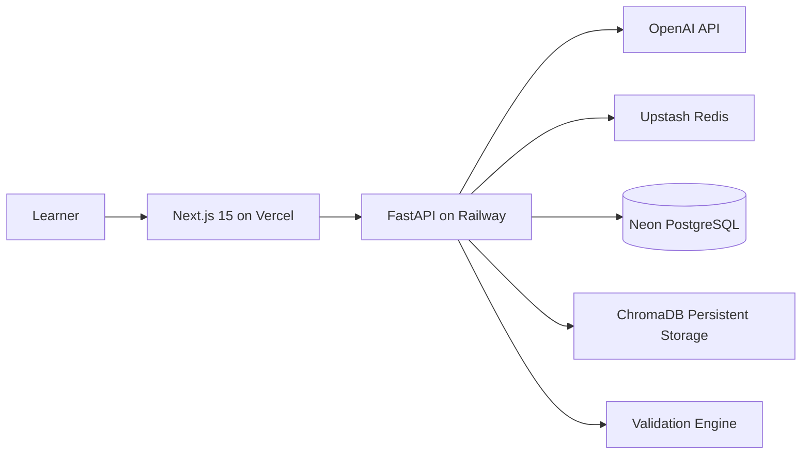

# Adaptive Quiz Generation API and AI Assessment Platform

A deployable full-stack AI assessment platform. The backend generates unique multiple-choice quizzes with Bloom's Taxonomy mapping, duplicate detection, validation, Redis-ready operational controls, PostgreSQL persistence, Docker, and CI. The frontend is a modern Next.js 15 application for quiz generation, quiz taking, results, and analytics.

## Architecture


## Backend capabilities
- `POST /generate-quiz`: accepts topic, difficulty, and number of questions up to 10.
- `POST /validate-quiz`: validates topic relevance, answer integrity, duplicates, and difficulty alignment.
- `GET /quiz/{id}`: retrieves a persisted quiz.
- `DELETE /quiz/{id}`: deletes a quiz and related records.
- `GET /analytics`: returns generation analytics summary.
- `GET /health`: deployment health check.

## Frontend capabilities
- Landing page with product overview, AI quiz generation demo, features, and CTA.
- Quiz generator with topic, difficulty, and number-of-questions inputs.
- Quiz-taking interface with timer, navigation, answered-state tracking, and progress.
- Results page with score, correct answers, wrong answers, answer review, and Bloom analysis.
- Analytics dashboard with quiz history, performance trends, difficulty analysis, and Bloom distribution charts.

## Project structure
- `app/api`: FastAPI routes and Swagger-visible endpoints.
- `app/core`: settings and logging.
- `app/db`: async database session, metadata, Alembic migrations.
- `app/models`: SQLAlchemy models for users, quizzes, questions, attempts, analytics.
- `app/schemas`: Pydantic v2 request/response contracts.
- `app/services`: orchestration, Redis, and application services.
- `app/quiz_engine`: generation, difficulty, and Bloom logic.
- `app/embeddings`: embedding provider and duplicate detector.
- `app/validators`: scoring and validation rules.
- `frontend/app`: Next.js App Router pages and layouts.
- `frontend/components`: reusable shadcn-style UI and chart components.
- `frontend/hooks`: React Query hooks.
- `frontend/services`: backend API client.
- `frontend/types`: TypeScript contracts.
- `tests`: unit and integration tests.
- `docs`: architecture and deployment guides.

## Local development
```bash
cp .env.example .env
docker compose up --build
```

Backend Swagger is available at `http://localhost:8000/docs`.

Frontend local development:
```bash
cd frontend
npm install
npm run dev
```

## API example
```bash
curl -X POST http://localhost:8000/generate-quiz \
  -H 'Content-Type: application/json' \
  -d '{"topic":"PostgreSQL indexing","difficulty":"medium","number_of_questions":10}'
```

## Deployment
- Frontend: Vercel using `vercel.json`.
- Backend: Railway using `railway.toml` and `Dockerfile`.
- Database: Neon PostgreSQL through `DATABASE_URL`.
- Redis: Upstash through `REDIS_URL`.
- Vector store: ChromaDB persistent storage through `CHROMA_PATH`.

See `docs/deployment.md` for step-by-step deployment instructions.

## Resume impact
- Generated 10 validated MCQs per request with async FastAPI orchestration.
- Eliminated duplicate questions using embedding similarity checks with a 0.85 threshold.
- Implemented Bloom's Taxonomy classification across Remember, Understand, Apply, Analyze, Evaluate, and Create.
- Built a full-stack AI assessment platform with Next.js, React Query, TailwindCSS, Recharts, FastAPI, PostgreSQL, Redis, and vector similarity validation.
