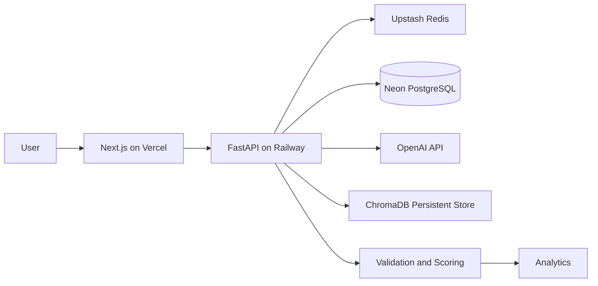

# System Design

## Business problem
Teachers, instructional designers, and EdTech applications need high-quality assessments faster than manual authoring allows. This system generates ten unique MCQs from a topic and difficulty, validates them, and reports cognitive coverage with Bloom's Taxonomy.

## Personas
- Educators creating formative assessments.
- Corporate L&D teams producing compliance quizzes.
- EdTech platforms embedding adaptive practice.
- Learners requesting self-study assessments.

## Scalability
FastAPI workers are stateless and horizontally scalable. PostgreSQL stores relational quiz data, Redis handles low-latency cache/rate/session workloads, and ChromaDB persistent storage supports similarity search. The frontend deploys independently to Vercel and calls the Railway backend over HTTPS.

## Architecture

## Alternatives considered
- Django REST instead of FastAPI: stronger admin features but heavier for async LLM workloads.
- pgvector instead of ChromaDB: simpler operations in Postgres, but ChromaDB is easier for local vector experimentation.
- Self-hosted LLMs instead of OpenAI: more control, higher operational cost.
- Memcached instead of Redis: cache-only; Redis also supports rate counters and sessions.
