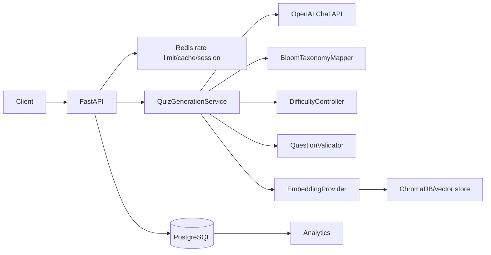

# System Design

## Business problem
Educators and training teams spend hours producing high-quality, level-appropriate MCQs. The API automates creation of ten unique questions for a topic and difficulty while enforcing Bloom's Taxonomy, duplicate detection, and validation.

## Personas
- Educators creating lesson checks.
- EdTech platforms generating adaptive practice.
- Corporate L&D teams building compliance assessments.
- Learners requesting targeted self-study quizzes.

## Scalability requirements
The service separates stateless FastAPI workers, PostgreSQL persistence, Redis low-latency controls, and vector similarity storage so generation can scale horizontally. LLM calls are bounded to ten accepted questions, cacheable, rate-limited, and validated before persistence.

## Architecture

## Technology choices and alternatives
- FastAPI: async Python, OpenAPI docs, Pydantic integration. Alternative: Django REST for heavier batteries-included apps.
- OpenAI API: strong generation and embeddings. Alternative: self-hosted Llama for strict data residency.
- PostgreSQL: relational integrity for users, quizzes, attempts, analytics. Alternative: MySQL, but Postgres has stronger JSON and indexing ergonomics.
- Redis: rate limits, cache, session storage. Alternative: Memcached for cache-only workloads.
- ChromaDB: simple vector persistence for duplicate detection. Alternative: pgvector for operational consolidation.
- SQLAlchemy Async: mature ORM with async IO. Alternative: Tortoise ORM with smaller ecosystem.
- Pydantic v2: fast validation and schema generation. Alternative: attrs/dataclasses with manual OpenAPI mapping.
- Docker: repeatable deployment. Alternative: direct VM installs, less portable.
- pytest: concise unit/integration testing. Alternative: unittest, more verbose.
